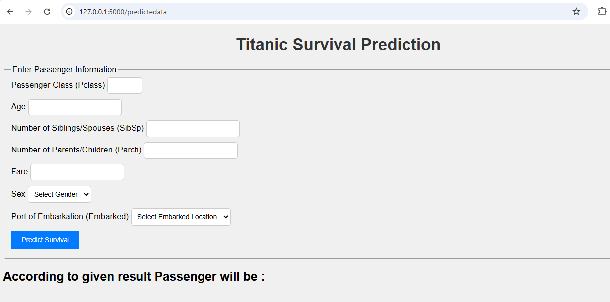

# 🚢 End-to-End Machine Learning Project

## 🎓 Titanic Survival Prediction 📊

**🌟 Project Overview**

This project is a full End-to-End Machine Learning Web Application that predicts whether a Titanic passenger would survive based on inputs like passenger class, age, fare, and more. The application provides a seamless interface for users to enter information and receive real-time predictions on survival outcomes.

**🗂️ Project Structure**
```bash
project_root/
├── app.py                    # Main Flask application
├── requirements.txt          # Dependencies
├── Dockerfile                # Docker setup for the app
├── src/                      # Core code folder
│   ├── components/           # Data ingestion, transformation, and training
│   ├── pipeline/             # Prediction and training pipelines
│   ├── utils.py              # Utility functions
│   ├── logger.py             # Logging configuration
│   └── exception.py          # Exception handling
├── Streamlit/                # Streamlit application files
│   ├── TitanicWeb.py         # Main Streamlit app
│   └── Predict.py            # Prediction helper functions for Streamlit
├── templates/                # HTML templates
│   ├── index.html
│   └── home.html
├── static/                   # Static files (CSS, JS)
│   └── css/
│       └── styles.css        # Styling for the app
└── config/                   # Configuration files
    ├── __init__.py           # Package initializer
    ├── database_conn.py      # Database connection setup
    └── insert_data.py        # Function to insert prediction data into the database
```
**🚀 Features**

* Real-Time Predictions: Input passenger details to instantly predict survival.
* Customizable: Easily expandable with additional input features or model enhancements.
* Model Training: Full pipeline for model training, evaluation, and hyperparameter tuning.

**🛠️ Technologies Used**

* Frontend: HTML, CSS (optionally with Tailwind CSS)
* Backend: Flask, Python
* Machine Learning Models:
* Logistic Regression, Decision Tree, Random Forest, SVM ,KNeighbhor, Bagging, Adaboosting

**📸 Screenshots**




**📦 Getting Started**

**Prerequisites**
* Install Python >= 3.7
* Install Docker (optional, for containerized deployment)