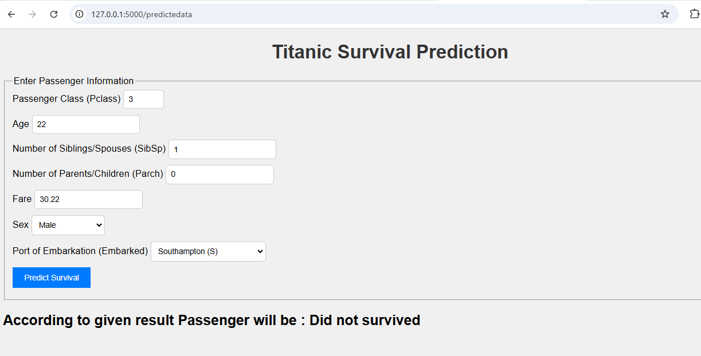
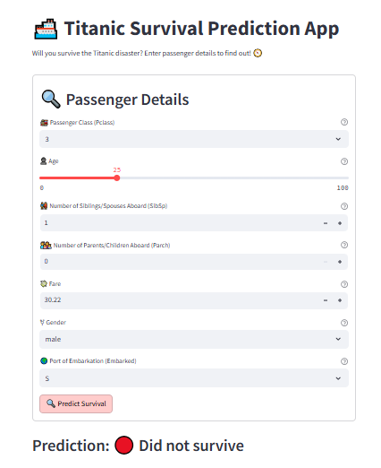

# 🚢 End-to-End Machine Learning Project

## 🎓 Titanic Survival Prediction 📊

**🌟 Project Overview**

This project is a full End-to-End Machine Learning Web Application that predicts whether a Titanic passenger would survive based on inputs like passenger class, age, fare, and more. The application provides a seamless interface for users to enter information and receive real-time predictions on survival outcomes.

**🗂️ Project Structure**
```bash
project_root/
├── app.py                    # Main Flask application
├── requirements.txt          # Dependencies
├── Dockerfile                # Docker setup for the app
├── src/                      # Core code folder
│   ├── components/           # Data ingestion, transformation, and training
│   ├── pipeline/             # Prediction and training pipelines
│   ├── utils.py              # Utility functions
│   ├── logger.py             # Logging configuration
│   └── exception.py          # Exception handling
├── Streamlit/                # Streamlit application files
│   ├── TitanicWeb.py         # Main Streamlit app
│   └── Predict.py            # Prediction helper functions for Streamlit
├── templates/                # HTML templates
│   ├── index.html
│   └── home.html
├── static/                   # Static files (CSS, JS)
│   └── css/
│       └── styles.css        # Styling for the app
└── config/                   # Configuration files
    ├── __init__.py           # Package initializer
    ├── database_conn.py      # Database connection setup
    └── insert_data.py        # Function to insert prediction data into the database
```
**🚀 Features**

* Real-Time Predictions: Input passenger details to instantly predict survival.
* Customizable: Easily expandable with additional input features or model enhancements.
* Model Training: Full pipeline for model training, evaluation, and hyperparameter tuning.

**🛠️ Technologies Used**

* Frontend: HTML, CSS (optionally with Tailwind CSS)
* Backend: Flask, Python
* Machine Learning Models:
* Logistic Regression, Decision Tree, Random Forest, SVM ,KNeighbhor, Bagging, Adaboosting

**📸 Screenshots**






**📦 Getting Started**

**Prerequisites**
* Install Python >= 3.7
* Install Docker (optional, for containerized deployment)

**Installation**

* Clone the repo:
   ```bash
   git clone https://github.com/Siddhesh2241/titanic-survival-prediction.git
   cd titanic-survival-prediction
   ```
* Install dependencies:
  ```bash
  pip install -r requirements.txt
  ```
* Run the app:
  ```bash
  python app.py
  ```
* Run the Streamlit app: Navigate to the Streamlit directory and run:
  ```bash
  streamlit run Streamlit\TitanicWeb.py
  ```
* Calculate Prediction using streamlit web page
  ```bash
  streamlit run Streamlit\Predict.py
  ```

**🎛️ Model Training and Hyperparameter Tuning**

Run model training with hyperparameter tuning by configuring parameters in train_pipeline.py. This setup uses multiple algorithms (e.g., n_estimators for Random Forest) for optimized performance.

```bash
from sklearn.model_selection import GridSearchCV

param_grid = {
    'RandomForestClassifier': {
        'n_estimators': [100, 200, 300],
        'max_depth': [10, 20, None]
    },
    'SVC': {
        'C': [0.1, 1, 10],
        'kernel': ['linear', 'rbf']
    }
}

```
**🌍 Usage**

* Open your browser and go to http://127.0.0.1:5000.
* Fill in details like passenger class, age, fare, gender, and embarkation.
* Click on Predict Survival to get an instant prediction.

**🤖 Future Enhancements**

* Add More Models: Incorporate advanced models like XGBoost and CatBoost for improved accuracy.
* User Authentication: Add user login to save individual predictions.
* Enhanced UI/UX: Improve the frontend with better design and interactive visualizations.

**📝 License**

This project is licensed under the MIT License - see the LICENSE file for details.

**🎉 Thank you for checking out this project! 🎉**

Feel free to open an issue or pull request if you'd like to contribute.
